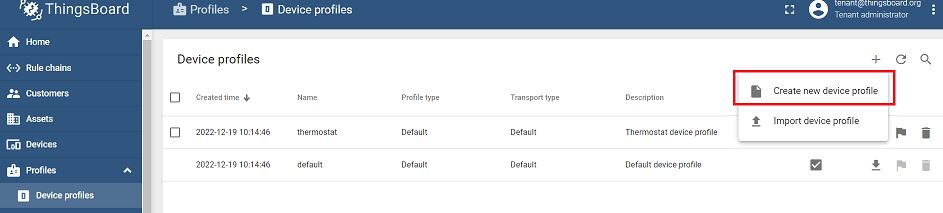

# helm-for-inbm-thingsboard

There are two helm charts in the helm folder.
1. INBM
   - Reference: https://github.com/intel/intel-inb-manageability
2. Thingsboard

# Installation
1. Ensure that K8s cluster and Helm are installed on the system.
2. Install Thingsboard with Helm command.
   ```
   sudo helm install tb helm/thingsboard
   ```
3. Check the cluster IP of Thingsboard. Record down the cluster IP.

   `sudo kubectl get svc | grep tb`

   

4. Login to Thingsboard with the cluster IP and port 9090. 
The username and password as below:
   ```
   Username: tenant@thingsboard.org
   Password: tenant 
   ```
   

5. Download [intel_manageability_widgets_version_3.3.json](https://github.com/intel/intel-inb-manageability/blob/develop/inbm/cloudadapter-agent/fpm-template/usr/share/cloudadapter-agent/thingsboard/intel_manageability_widgets_version_3.3.json) and [intel_manageability_devices_version_3.3.json](https://github.com/intel/intel-inb-manageability/blob/develop/inbm/cloudadapter-agent/fpm-template/usr/share/cloudadapter-agent/thingsboard/intel_manageability_devices_version_3.3.json).
6. Import widgets bundle into Thingsboard.
   
7. Import dashboard into Thingsboard.
   
8. Go to Profiles and create device profile. Select "**INB-intel Manageability Devices**" as mobile dasboard.
   
   

9. Go to Devices and create new device. Enter the name of device and select the device profile added just now. 
   
   

10. Click the newly added device and record down the access token.

   

11. Go to inbm [configmap](helm\inbm\templates\configmap.yaml). Under mqtt configuration, update the username as your **access token** and the hostname as your Thingsboard's **cluster IP**.

   

12. Install inbm with Helm command.
    ```
    sudo helm install tb helm/inbm
    ```
13. Go to Dashboard > INB-Intel Manageability Devices and check the dashboard.  